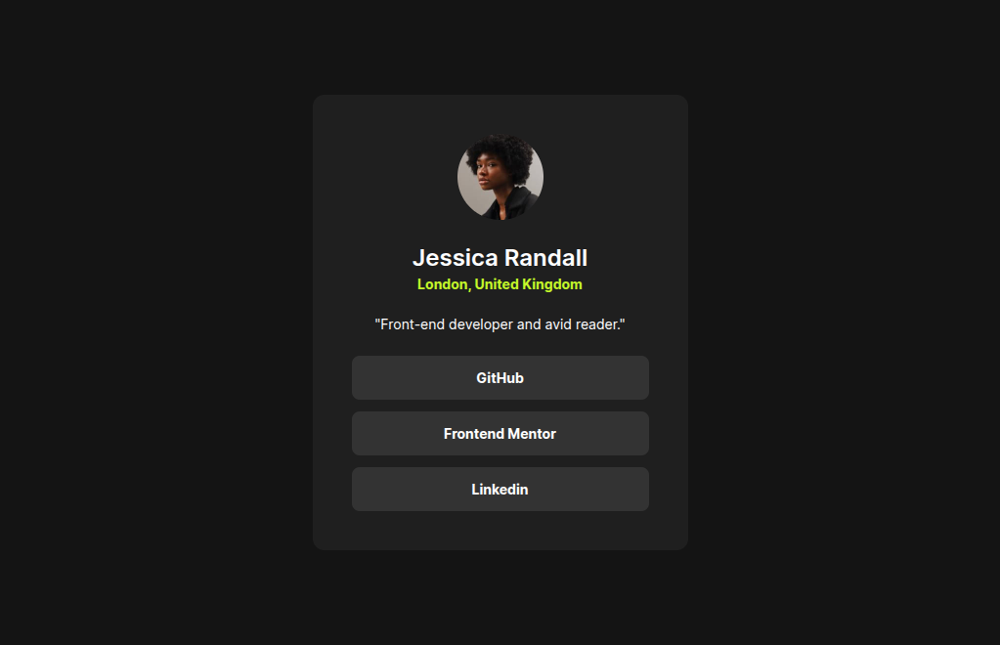

# Frontend Mentor - Social links profile solution

This is a project made to the [Blog preview card challenge on Frontend Mentor](https://www.frontendmentor.io/challenges/social-links-profile-UG32l9m6dQ). Status: In Progress.

## Table of contents

- [Overview](#overview)
  - [Screenshot](#screenshot)
  - [Links](#links)
- [My process](#my-process)
  - [Built with](#built-with)
  - [Continued development](#continued-development)
- [Author](#author)

## Overview

### Screenshot

Im going to add later

### Links

- Live Site URL: [Github Pages](https://luizhen527.github.io/social-links-profile/)

## My process

### Built with

- Semantic HTML5 markup
- CSS custom properties
- Flexbox

### Continued development

These are the things I still need to get better at or study more about:

- Learn best way to use relative units.

<!-- - [Example resource 1](https://www.example.com) - This helped me for XYZ reason. I really liked this pattern and will use it going forward.
- [Example resource 2](https://www.example.com) - This is an amazing article which helped me finally understand XYZ. I'd recommend it to anyone still learning this concept. -->

## Author

- Frontend Mentor - [@LuizHen527](https://www.frontendmentor.io/profile/LuizHen527)
- Linkedin - [@luizhen765](https://www.linkedin.com/in/luizhen765/)
